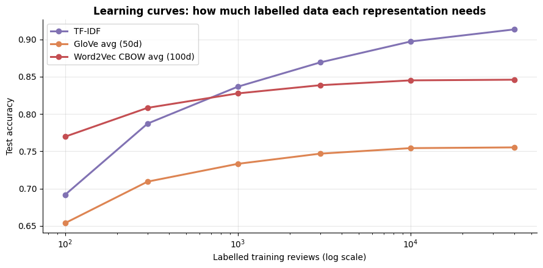
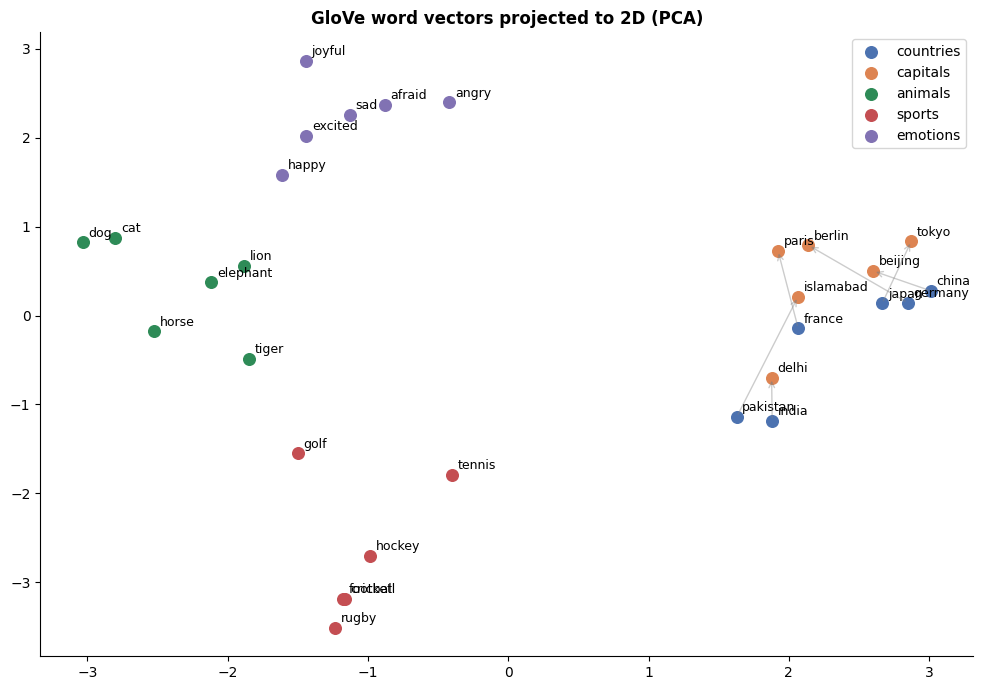
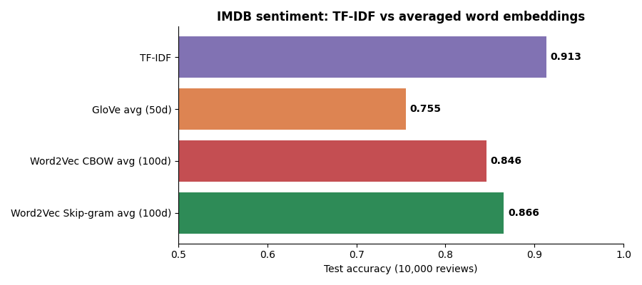

# 🧠 Word Embeddings vs TF-IDF

[](https://colab.research.google.com/github/MMujtabaX/word-embeddings-vs-tfidf/blob/main/word_embeddings_vs_tfidf.ipynb)


Sparse word counts or dense vectors that encode meaning? This project explores **pretrained GloVe** embeddings, trains **Word2Vec (CBOW and Skip-gram)** from scratch on 40,000 movie reviews, and puts every representation head to head against **TF-IDF** on IMDB sentiment classification, including how the winner changes with the amount of labelled data.

<p align="center">
  
</p>
<p align="center"><sub>With ~100 labels, IMDB-trained Word2Vec wins. With thousands, TF-IDF pulls ahead. General-purpose GloVe never catches up.</sub></p>

## 📊 Key Results

**IMDB sentiment, 40K train / 10K test, logistic regression:**

| Representation | Dimensions | Accuracy |
|----------------|-----------|----------|
| **TF-IDF** (words + bigrams) | 624,165 (sparse) | **91.4%** |
| Word2Vec Skip-gram, averaged (trained on IMDB) | 100 | 86.6% |
| Word2Vec CBOW, averaged (trained on IMDB) | 100 | 84.6% |
| GloVe, averaged (Wikipedia/news) | 50 | 75.5% |

**Accuracy vs number of labelled training reviews:**

| Labels | TF-IDF | Word2Vec CBOW | GloVe |
|--------|--------|---------------|-------|
| 100 | 69.2% | **77.0%** ✅ | 65.4% |
| 300 | 78.7% | **80.8%** ✅ | 70.9% |
| 1,000 | **83.7%** | 82.8% | 73.3% |
| 40,000 | **91.4%** | 84.6% | 75.5% |

**Findings:**
1. **Few labels → embeddings win.** Word2Vec learned from 40K *unlabelled* reviews gives an 8-point head start with only 100 labels.
2. **Many labels → TF-IDF wins.** Sentiment lives in specific words and phrases, and averaging hundreds of vectors blurs them together.
3. **Domain beats scale.** IMDB-trained Word2Vec beats GloVe (trained on 6B tokens) by about 10 points at every size.

## 🔬 What's Inside

### 1. Exploring pretrained GloVe

| Analogy | Answer |
|---------|--------|
| king − man + woman | **queen** |
| paris − france + italy | **rome** |
| walking − walk + swim | **swimming** |
| pakistan − islamabad + tokyo | **japan** |

<p align="center">
  
</p>

Countries, capitals, animals, sports and emotions form separate clusters, and the country → capital arrows point in similar directions.

### 2. Sentence similarity: the strengths and the catch

| Sentence A | Sentence B | TF-IDF | GloVe |
|------------|------------|--------|-------|
| The acting was superb | The performances were excellent | 0.07 | **0.88** |
| I loved this picture | I adored this film | 0.28 | **0.95** |
| The movie was fantastic | The movie was **terrible** | 0.55 | **0.97** ⚠️ |

Embeddings recognize paraphrases that TF-IDF misses entirely, but they also rate **antonyms as near-identical**. "Fantastic" and "terrible" appear in the same contexts, so distributional vectors place them together. That's a key reason averaged embeddings struggle with sentiment.

### 3. Training Word2Vec: CBOW vs Skip-gram

Trained on 9.2 million words of movie reviews. CBOW took 47s; Skip-gram took 168s, about 3.5× slower.

| Word | GloVe (general) | Word2Vec (IMDB) |
|------|-----------------|-----------------|
| plot | plots, plotting, conspiracy | storyline, premise, script, narrative |
| boring | awfully, pretty, funny | dull, pointless, tedious, predictable |
| awful | horrible, terrible, dreadful | terrible, dreadful, abysmal, atrocious |

The domain-trained model learns how *reviewers* use words. To GloVe, a "plot" is a conspiracy.

### 4. The showdown

<p align="center">
  
</p>

## ⚖️ When to Use Which

| | TF-IDF | Static embeddings |
|--|--------|-------------------|
| Synonyms ("film" ≈ "movie") | ❌ | ✅ |
| Antonyms ("great" vs "terrible") | ✅ different words | ⚠️ placed close together |
| Classification with many labels | ✅ strong baseline | weaker when averaged |
| Classification with ~100 labels | weaker | ✅ with domain-trained vectors |
| Word similarity and analogies | ❌ | ✅ |
| Input to neural networks | — | ✅ standard first layer |

## 🚀 Run It

Click the **Open in Colab** badge above and choose **Runtime → Run all**. GloVe (66 MB) downloads through `gensim`, and IMDB loads from a public CSV. The full run takes about 8–10 minutes, mostly Skip-gram training.

```bash
pip install gensim scikit-learn pandas numpy matplotlib
```

## 🔮 Next Steps

- TF-IDF-weighted averaging of word vectors
- Feeding embeddings into an LSTM or CNN that keeps word order
- Contextual embeddings (BERT), where "bank" gets different vectors in "river bank" and "bank account"

## 🙏 Acknowledgements

Based on NLP course notes comparing word embeddings and TF-IDF; experiments, Word2Vec training and evaluation built on top.

## 👤 Author

**Muhammad Mujtaba Khan Suri** — CS @ UBIT, University of Karachi
[GitHub](https://github.com/MMujtabaX)
